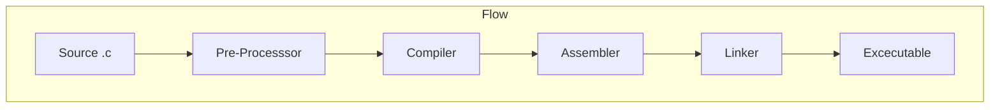

# Compiling flowchart 

```mermaid
    flowchart TD
        subgraph com [Flow]
        source["Source .c"] --> preprocessor["Pre-Processsor"]
        preprocessor --> Compiler
        Compiler --> Assembler
        Assembler --> Linker
        Linker --> Excecutable
        end
```
